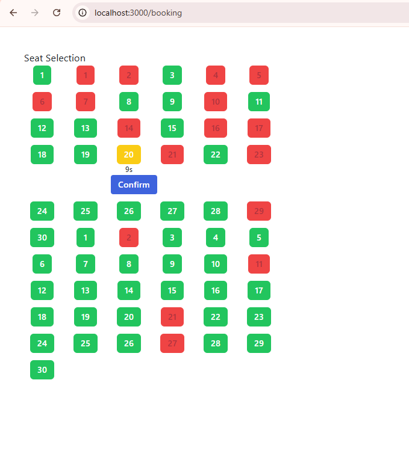
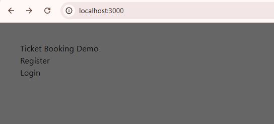
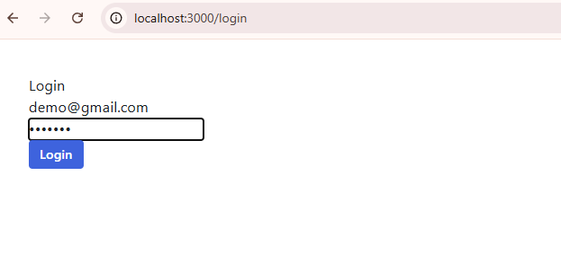
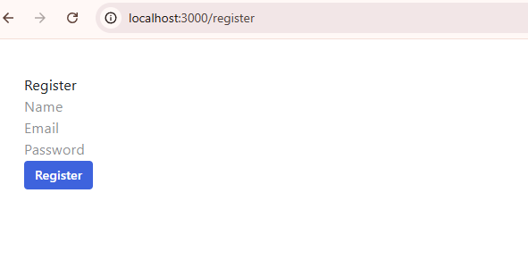

## Ticket Booking System

- A demo ticket booking system inspired by IRCTC / RedBus that implements time-based seat locking to handle concurrent bookings safely.

### Features

- Temporary seat locking with expiry timer

- Only lock owner can confirm booking

- Automatic release of expired locks

- JWT-based authentication

- Real-time seat status updates via polling

- Frontend built with Next.js + Radix UI

- Backend built with Node.js, Express, MongoDB

### Logic

- Seats are locked for a fixed duration during booking

- If not confirmed in time, seats are automatically released

- Other users cannot confirm or override locked seats

### Demo

Seat Booking UI

Dashboard

Login

Register

